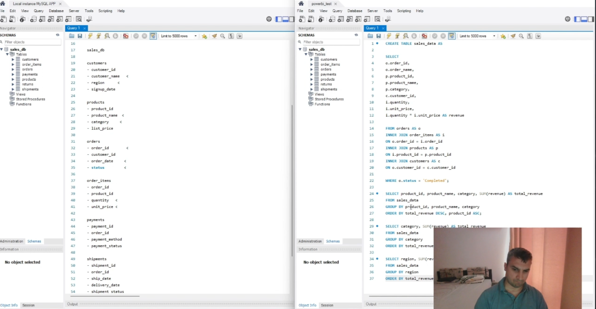
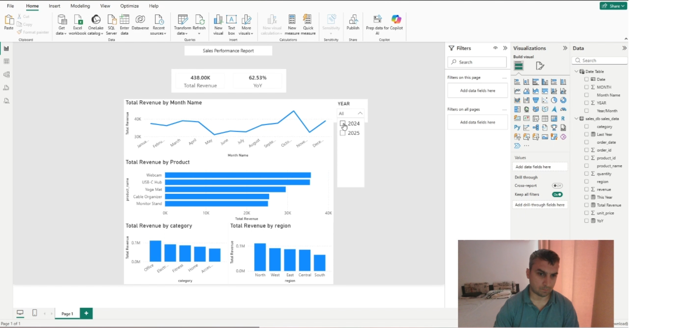

# SQL + Power BI Sales Analysis

## Business Request

Management wants a clearer understanding of company sales performance.

The analysis focuses on:

- Which products generate the most revenue?
- Which product categories are strongest?
- Which regions generate the most revenue?

## Tools

- MySQL
- Power BI

## Project Workflow

Business Request
→ Database Schema
→ SQL Data Preparation
→ SQL Analysis
→ Power BI Visualization
→ Business Conclusions

## SQL Analysis

The SQL workflow joins the relevant order, product, order-item and customer data, filters completed orders, calculates revenue, and produces summaries by:

- Product
- Category
- Region

## Power BI

The prepared data is used to create a report focused on revenue performance and the main revenue drivers.

## Project Walkthrough

🎥 **[Watch the full project walkthrough on LinkedIn](PASTE-YOUR-LINKEDIN-POST-LINK-HERE)**

## Screenshots

### SQL

### Power BI
